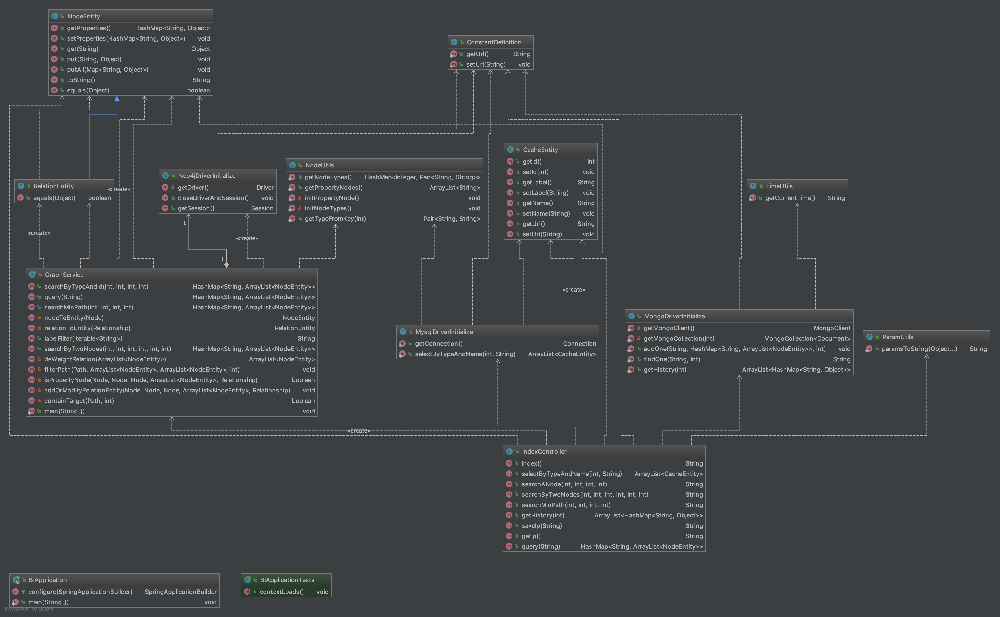

# 商务智能项目文档

## 项目架构分析

本项目是一个知识图谱展示网站。

- 前端使用vue+D3框架实现前端基本逻辑、样式设定以及数据可视化；
- 后端采用springboot框架，实现分发逻辑、图算法等功能；
- 数据库方面使用Neo4j存储基本节点及关系数据；使用MongoDB作为检索结果的缓存；使用MySQL存储所有节点名称和其对于的ID、标签。


### 类图



## 各数据库介绍

### Neo4j

Neo4j是一种面向/基于图的数据库，以`图`的形式存储数据，而这种数据格式的结构特殊性使得其在复杂繁琐的关系处理上很高效。

本项目使用其存储路透社提供的公开金融数据集，其中包含各类金融相关实体以及多实体之间的关系。我们使用Neo4j为本项目构建了知识图谱模型，并在此基础上提供一些检索服务。

#### 配置

机器内存16G，Neo4j分配如下：

```bash
dbms.memory.heap.initial_size=1G
dbms.memory.heap.max_size=4G
dbms.memory.pagecache.size=4G
```

#### 数据量

图数据库中共存有27.34GB图数据，其中：

- 节点数：21993143
- 关系数：61066697

### MongoDB

因项目中MongoDB和MySQL存储量较少，因此都选择使用了配置较低的服务器。

使用MongoDB的目的是为了缓存检索结果，提高Query Server的响应速度。我们将特定检索关键词的字符串连接结果作为key，并创建一个包含检索时间和检索结果的value，以此构建key-value对存储MongoDB中。在下一次query动作产生时，会先检索MongoDB中是否包含该历史记录，若包含则修改该记录的time字段，并将其返回，若不包含则创建一个key-value对存入MongoDB中。

存储结构如下：

| Collections(集合名称) | 说明                             |
| --------------------- | -------------------------------- |
| Single                | 查询单节点周围的关系及节点的结果 |
| Double                | 查询两节点间存在的多跳关系的结果 |
| MinPath               | 查询两节点间的最短路径           |

每个集合的存储文档格式都相同：

| DocumentKey | 说明                    |
| ----------- | ----------------------- |
| id          | 根据检索参数构建的key值 |
| time        | 检索的时间              |
| result      | 检索结果(json类型数据)  |

由于我们项目中图结构很大，对Neo4j的一次节点、关系检索通常是比较耗时的，而MongoDB的以key取值的操作确实很快的，因此使用MongoDB大大降低了用户的检索等待时间。

#### 数据量

MongoDB中主要用于存储用户检索的历史记录，数据的增加由用户的检索动作触发，当MongoDB中的数据量达到了预先设定的阈值（2G），会清理一次数据，即删除一半的记录。

### MySQL服务器配置

与MongoDB类似，MySQL的目的也是提高Query Server的响应速度。

在用户界面中，我们为其提供了一个搜索节点的功能，即根据实体的名称来搜索并返回相似的实体集合，并由用户选择一个（或两个，由选择的检索功能而定）特定的实体从而根据其返回对应的实体/关系结果集。

虽然Neo4j在处理关系上很高效，但是在独立实体上的查询就会很慢，因此我们使用关系型数据库MySQL存储所有节点的名称、ID、类型标签及其uri链接。

唯一一张表NeoCache的表结构：

| 字段名称 | 说明         | 备注                                       |
| -------- | ------------ | ------------------------------------------ |
| id       | 节点id       | 主键                                       |
| label    | 节点所属类型 | 索引`labelIndex`、符合索引`labelNameIndex` |
| name     | 节点名称     | 索引`nameIndex`、符合索引`labelNameIndex`  |
| uri      | 节点的链接   | 可直接跳转到官网介绍页面                   |

## ETL

## 查询功能实现

### 单节点及关系查询

#### 语句

```sql
MATCH p=((n:$label)-[*..$step]-()) where id(n)=$id return p limit $limit
```

对于节点`a`，给定四个参数`a的id`、`a的类型label`、`关系跳数限制`、`返回的路径数量限制`，直接返回其周围的关系和节点组成的结果集。

#### 效率

#### 优化策略

### 两节点多跳关系查询

Neo4j中的查询思路基本是从`起始节点`出发进行`深度`或`广度`遍历，而后查询直至找到`终止节点`。

广度优先的性能取决于结果节点是否靠近起始节点，即其深度；深度优先的性能取决于结果节点是在生成树的左侧还是右侧，越靠左侧就越有可能被先遍历到。而在最坏的情况下，结果节点同时位于树的最深和最右的位置，那么就需要遍历整个树即整张图。这在节点数较少的情况下还基本可以完成，而在我们项目场景中，节点周围多的可能会有几千甚至上万个关系，在BFS的情况下，N跳关系就可能需要存储1000<sup>N</sup>数量级的关系和节点，如此当N较大时，内存必然会爆炸。因此Neo4j一般选择DFS的方式搜索终止节点。

然而DFS也有个问题，当深度较小时，